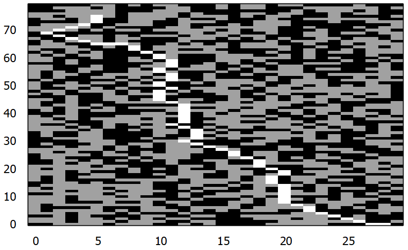

# a star
Simple a* (a star) algorithm in cpp for pathfinding and visualization in gnuplot.  
I took the a star implementation in cpp from https://github.com/thuva4/Algorithms .  
I did the visualization with gnuplot.  

## Usage
g++ and gnuplot have to be installed, see https://www.msys2.org/ .  
"pacman -S mingw-w64-ucrt-x86_64-gcc" to install g++.  
"pacman -S mingw-w64-x86_64-gnuplot" to install gnuplot.  
For the visualization of the path you need gnuplot, but it is not necessary.  
Without gnuplot, you have to rewrite the last part of the main function of astar.cpp .  
Type simply "g++ astar.cpp -o astar" for compiling.  
addRows.py is for generating more rows.  

## Example
A black cell means that this cell is blocked.  
A gray cell is unblocked but is not chosen of the a* algorithm as a part of the path.  
A white cell is a chosen part of the path.  

